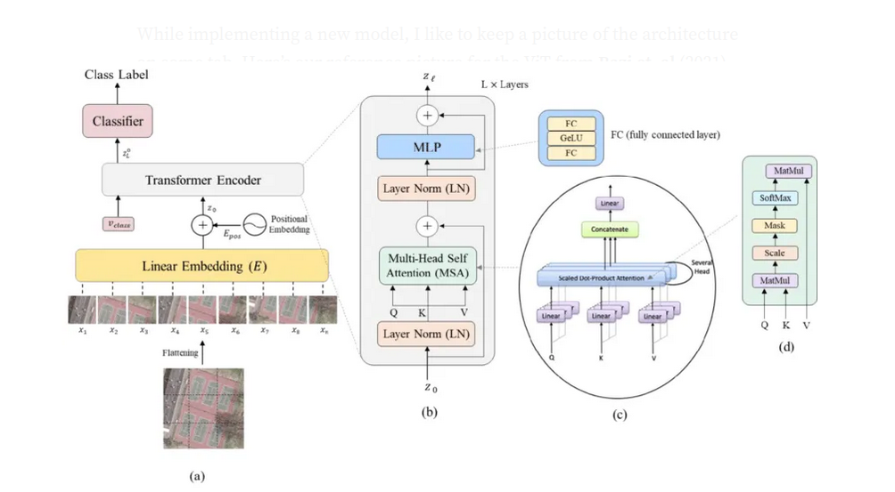

The Transformer architecture has revolutionized the use of attention, without relying on recurrence and convolutions as earlier attention models had previously done. Inspired by its success in NLP, researchers sought to apply the standard Transformer architecture to image; their target application at the time was image classification. Recall that the standard Transformer Model received a one-dimensional sequence of word embedding as input, since it was originally meant for NLP. In contrast, when applied to the task of image classification in computer vision, the input data to the Transformer model is provided in the form of two-dimensional images.

In various computer vision tasks, such as image classification or object detection, it is common to process images as a whole. However, when attempting to apply techniques inspired by natural language processing (NLP) to images, it becomes necessary to structure the image data in a way that resembles the sequential nature of text.

To achieve this, the input image is divided into smaller two-dimensional patches. Each patch represents a smaller region of the image and has a resolution of (p, p) pixels, where p represents the size of each patch. By breaking down the image into patches, we create a grid-like structure that can be processed sequentially.

The number of patches, N, is determined by the dimensions of the original image and the size of each patch. It is calculated as N = (H × W) / (P × P), where H is the height of the image, W is the width of the image, and P represents the size of each patch. This equation gives us the total number of patches that will be extracted from the image.
Once the image is divided into patches, each patch can be treated as an individual unit, similar to how words are treated in NLP. This allows for the application of techniques like recurrent neural networks (RNNs) or transformers, which are commonly used in NLP tasks, to process the image data in a sequential manner.

## Preprocessing steps applied to the image data before feeding it into a Transformer model


**Flattening Image Patches**: Each image patch, which represents a smaller region of the image, is flattened into a vector. The resulting vector, denoted as Xn_p, has a length of P * P * C, where P represents the patch size (width and height are equal) and C represents the number of channels in the image.

**Generating Embedded Image Patches**: The flattened image patches are then mapped to a lower-dimensional space, D, using a trainable linear projection, E, to reduce the dimensionality of the image patches and capture meaningful representations of the image content in a more compact form. This step generates a sequence of embedded image patches, where each patch is represented by a vector of dimension D.

**Prepending Class Embedding**: A learnable class embedding, denoted as X_class, is added at the beginning of the sequence of embedded image patches. This class embedding represents the classification output, y, and helps the model incorporate information about the target class into the input.

Augmenting Positional Embedding: One-dimensional positional embedding, denoted as E_pos, is added to the patch embedding. This positional embedding encodes information about the spatial position of each patch in the image, allowing the model to understand the relative locations of different patches. The positional embedding is also learned during the training process.

## Transformer Encoder Layer

In the Vision Transformer (ViT) model, the encoder part of the original Transformer architecture is used. The input to the encoder is a sequence of embedded image patches, which includes a learnable class embedding added at the beginning of the sequence. This input sequence is also augmented with positional information to provide spatial context.
The encoder processes the input sequence, attending to each patch and capturing the relationships between them. This allows the model to learn meaningful representations of the image content. The encoder consists of multiple layers of self-attention and feed-forward neural networks, which enable the model to effectively capture both local and global dependencies within the image.

After the encoder processes the input sequence, the output of the final encoder layer is fed into a classification head. The classification head is responsible for generating the final classification output based on the learned representations.


The value of the learnable class embedding, which was added at the beginning of the input sequence, is also provided as input to the classification head. This allows the model to incorporate the class-specific information into the classification process.

The classification head typically consists of one or more fully connected layers followed by a softmax activation function. These layers map the encoded representation of the image to the desired number of output classes and produce the probabilities or scores for each class.

Once the classification head generates the classification output, it can be used for various tasks such as image classification, object detection, or semantic segmentation, depending on the specific application of the ViT model.

## Training the ViT

During the pre-training stage, the ViT model's classification head, which is attached to the output of the encoder, is implemented using a Multi-Layer Perceptron (MLP) with one hidden layer and a GELU (Gaussian Error Linear Unit) non-linear activation function. This classification head is responsible for predicting the class labels during pre-training.

In the fine-tuning stage, the MLP in the classification head is replaced with a single feed-forward layer, initialized with zeros, of size D*K. Here, D represents the dimensionality of the encoded representation, and K denotes the number of classes specific to the task being fine-tuned. This modified classification head is used to generate the classification output for the target task.

To process an input image of size 112 x 112, it is divided into non-overlapping patches of size 16 x 16. This results in a grid of 49 patches for the entire image. Each patch contains 3 color channels (assuming an RGB image).

The ViT model then applies a linear projection layer to each of these patches individually. This linear projection layer maps the flattened patch into a lower-dimensional space, typically referred to as the embedding dimension, capturing meaningful representations of the patch content.

By dividing the image into patches and applying the linear projection layer, the model can process the image in a sequence-like manner, similar to how words are processed in natural language processing.


**Patch Embedding**

The total number of non-overlapping patches in the image is 49. Each patch has a size of 16 x 16 pixels and contains 3 color channels, resulting in a patch size of 16*16*3 = 768.
The patch embedding matrix is created by flattening each patch into a long vector of size 768. Therefore, the patch embedding matrix has dimensions of 49*768.
In addition to the embedded patches, class tokens are added to the sequence. This means that a special token representing the target class is included in the input sequence. Consequently, the size of the patch embedding is increased to 50 (49 patches + 1 class token).

**Positional Encoding**
In the original Transformer architecture, as introduced in the paper "Attention is All You Need" by Vaswani et al., positional embeddings are used to give the model information about the position of the tokens in the sequence. These embeddings are added to the input embeddings before they are fed into the Transformer layers.

In ViT, positional embedding is often learned rather than fixed sinusoidal functions. The ViT learns a unique positional embedding for each patch position, and these embeddings are added to the patch embeddings. This means that there is a matrix of positional embeddings with the same dimensions as the patch embeddings (i.e., if you have 49 patches and each patch embedding has a size of 768, the positional embedding matrix would also be 49x768). These learned positional embeddings are optimized during the training process along with the other parameters of the model.

Positional encoding helps the model differentiate between the patches and capture their relative positions in the image. Without positional encoding, the transformer would struggle to retain spatial information, resulting in a significant decrease in accuracy (around 3%).

**Transformer Encoder Layer**

Especially in ViTs, the most important component is the transformer encoder that contains MHSA (Multi-head self-attention) and MLP (Multilayer perceptron) block. The encoder layer receives combined embedding (patch embedding, positional embedding, and class tokens) of shape 50 (49 patches and 1[cls] token) * 768 (16*16*3) as input. For all layers, the inputs and output matrix shape 50*768 from the previous layer.


In ViT-Base architecture, there are 12 heads (also known as layers). Before feeding input into the MHA block, the input is being normalized through normalization layer. In MHA, the input are converted into 50*768(256*3) shape using a linear layer to obtain the Query, Key and Value matrix.

Once we obtain the outputs from the MHSA block, these outputs are passed to skip connection as an input to obtain the final output. Before obtaining the final output, the output is fed into the normalization layer and passed to the MLP block. Originally, the MLP block was comprised of linear layers and a GELU activation function. Due to the significant progress in ViT, a locality mechanism is introduced in MLP to capture local features. Furthermore, depth-wise convolution is embedded in the MLP block after the first FC layer to reduce parameters and achieve superior results. Finally, the outcome of the MLP block feeds in to skip connection to obtain final outcome from an encoder layer.

## Pytorch Implementation 

**Changing Images into Tokens**
* **
**Input**
The function img_to_patch(x, patch_size, flatten_channels=True) takes an image tensor x, the size of each patch patch_size, and a boolean flatten_channels as input. The purpose of this function is to convert the image tensor into patches with a specified size and flatten the patches into vectors.
* **
**Extracting Dimensions**
B, C, H, W = x.shape extracts the values of the batch dimension (B), number of channels (C), height (H), and width (W) from the shape of the input image tensor x.
* **
**Reshaping and Slicing into Patches**
x = x.reshape(B, C, H//patch_size, patch_size, W//patch_size, patch_size) reshapes the input tensor x to split it into patches. It uses reshape to rearrange the dimensions, where the height and width are divided by patch_size to determine the number of patches in each dimension. The resulting shape of x becomes [B, C, H//patch_size, patch_size, W//patch_size, patch_size]
* **
**Permuting**
x = x.permute(0, 2, 4, 1, 3, 5) permutes the dimensions of x to rearrange them in a desired order. This line is typically used to bring the batch dimension (0) and the channels dimension (1) to the desired positions. The resulting shape of x becomes [B, H', W', C, p_H, p_W], where H' and W' represent the dimensions of the patch grid.
* **
**Flattening Patches**
x = x.flatten(1, 2) flattens the tensor x along dimensions 1 and 2. This operation collapses the dimensions corresponding to the patch grid (H' and W'), resulting in a tensor of shape [B, H'*W', C, p_H, p_W].
* **
**Flattening Channels**
If the flatten_channels flag is True, the following line x = x.flatten(2, 4) flattens the tensor x along dimensions 2 and 4. This operation concatenates the channels (C) and the patch dimensions (p_H and p_W) into a single dimension. The resulting shape of x becomes [B, H'W', C p_H * p_W].
* **
**Return**
Finally, the function returns the tensor x, which represents the image divided into patches with the specified patch size. If flatten_channels is True, the patches are flattened into vectors.
* ** 

```python

    def img_to_patch(x, patch_size, flatten_channels = True):
    B,C,H,W = x.shape
    x = x.reshape(B, C, H//patch_size, patch_size, W//patch_size, patch_size)
    x = x.permute(0, 2, 4, 1, 3, 5)
    x = x.flatten(1, 2)       # [B, H*W, C, p_H, p_W]

    if flatten_channels:
        x = x.flatten(2, 4)

  return x
```

**Plotting the Patches**
* ** 
**Generate Patches**
The img_to_patch function is called to convert images from the CIFAR dataset into patches. The patch_size is set to 4, and flatten_channels is set to False, which means each patch will keep its 3-dimensional shape (channels, height, width) instead of being flattened into a 1D vector.
* **
**Prepare the Plot**
A matplotlib subplot is created with the number of rows equal to the first dimension of the CIFAR images tensor (which is likely the batch size or number of images) and one column. The figsize argument sets the width and height of the figure.
* **
**Loop Over Images**
The script loops over each image in the batch (the range is based on the first dimension of the CIFAR images tensor).
* **
```python
    NUM_IMAGES= 4
    CIFAR_images = torch.stack([val_set[idx][0] for idx in range(NUM_IMAGES)], dim=0)
    img_to_patches = img_to_patch(CIFAR_images, patch_size = 4, flatten_channels = False)

    fig, ax = plt.subplots(CIFAR_images.shape[0], 1, figsize = (14, 3))
    fig.title = "Image as input sequence of patches"
    for i in range(CIFAR_images.shape[0]):
    img_grid = torchvision.utils.make_grid(img_to_patches[i], nrow = 64, normalize = True, pad_value = 0.9)
    img_grid = img_grid.permute(1, 2, 0)
    ax[i].imshow(img_grid)
    ax[i].axis("off")

    plt.show()
    plt.close()
```


Now that we have looked at the preprocessing, we can start building the Transformer model. We will be using the PyTorch module, nn.MultiheadAttention. Further, we use the Pre-Layer Normalization version of the Transformer blocks proposed by Ruibin Xiong in 2020. The idea is to apply Layer Normalization not in between residual blocks, but instead as a first layer in the residual blocks. This reorganization of the layers supports better gradient flow.


**Post-LN Transformer Layer (a)**
In this configuration, the input first goes through a Multi-Head Attention block, followed by an addition operation with the original input(residual connection), and then it is normalized by a Layer Normalization (LN). Similarly, the output of this LN is passed through a Feed-Forward Network (FFN), followed by another addition with the LN output, and a second LN.
**Pre-LN Transformer Layer (b)**
Here, the input is first normalized and then passed through the Multi-Head Attention block, followed by an addition with the original input. This is then normalized again before going through the FFN and other addition operation with the LN output, without a subsequent normalization.

## The ViT Architecture



### The Attention Block
```python
    class AttentionBlock(nn.Module):
    def __init__(self, embed_dim, hidden_dim, num_heads, dropout  = 0.0):
        super().__init__()
        self.layer_norm_1 = nn.LayerNorm(embed_dim)
        self.attn = nn.MultiheadAttention(embed_dim, num_heads, dropout = dropout)
        self.layer_norm_2 = nn.LayerNorm(ember_dim)
        self.linear = nn.Sequential(
            nn.Linear(embed_dim, hidden_dim),
            nn.GELU,
            nn.Dropout(dropout),
            nn.Linear(hidden_dim, embed_dim),
            nn.Dropout(dropout)
        )

    def forward(self, x):
        inp_x = self.layer_norm_1(x)
        x =  x + self.attn(inp_x, inp_x, inp_x)[0]
        x = x + self.linear(self.layer_norm_2(x))

        return x
```
### CLS Token
The concept of the class token in Vision Transformers (ViT) is borrowed from the BERT model in natural language processing (NLP). In NLP, BERT uses a special [CLS] token that is prepended to the input sequence. Similarly, in ViT, a similar approach is used where a class token is added to the sequence of image patch embedding.

The purpose of the class token is to aggregate global information from the sequence of embedding as it passes through the transformer layers. It serves as a representation of the entire image and captures the essential information needed for the final classification decision.

As the class token flows through each transformer layer, it accumulates information from all image patches through the self-attention mechanism. This means that the class token interacts with each patch and attends to relevant features in the image. By doing so, it becomes a distilled representation of the entire image, containing the features necessary for classification.

The specific features captured by the class token are learned during the training process. The transformer architecture enables the class token to learn the most relevant features from the entire image for the given task, whether it involves recognizing objects, scenes, or other visual patterns.


**Dimension of CLS Token**
The class token in Vision Transformers (ViT) is typically initialized with a shape of ```(1, 1, embed_dim)```, where:
* The first '1' indicates a single class token.
* The second '1' indicates that there is one class token per sequence or per image.
* 'embed_dim' represents the size of the embedding vector, which matches the dimensionality of the patch embeddings.

For example, if the dimension of the image is ```[B, H'*W', C*p_H*p_W]```, where B is the batch size, H' and W' are the height and width of the image grid, C is the number of channels, and p_H and p_W are the height and width of each patch, then the shape of the tokens tensor would be ```[B, num_patch, patch_size_vector]```, such as [B, 49, 8].

To add the class token to each sequence in the batch, the class token's embedding must be replicated 'B' times. Therefore, the initial dimensions of the class token would be (1, 1, embed_dim) or (1, 1, 8) in the given example.
To concatenate the class token with the tokens tensor, the class token is expanded to match the batch size 'B'. The expanded dimensions for the class token would be (B, 1, embed_dim) or (B, 1, 8).

When the class token is concatenated with the tokens tensor, the resulting tensor would have the shape ```(B, 50, embed_dim)``` or ```(B, 50, 8)```. This shape represents the batch size 'B', the total number of items in the sequence ```(49 patches + 1 class token)```, and the embedding dimension.
After propagating through the transformer encoder, the final state of the class token, which is still (B, 1, embed_dim), is used by the classifier head (often an MLP) to make the final classification decision. The classifier head takes the information captured by the class token and processes it to produce the desired classification output.

**Concatinating CLS Token**

```python
    cls_token = self.cls_token.repeat(B, 1, 1)
```
The class token, which is a learnable parameter initialized in the model, is repeated 'B' times to match the batch size. This way, each item in the batch has its own copy of the class token.

```python
    x = torch.cat([cls_token, x], dim=1)
```
The class token is concatenated with the input sequence of patches, 'x'. By adding the class token at the beginning of the sequence, we include global information about the image in the input. This helps the model capture context and makes better predictions.

### Positional Embedding
In the vision transformer and other transformer based models, positional embedding is used to provide the model with information about the order or position of the input tokens because transformers by their nature do not have any inherent notion of sequence order.
Positional Embedding is a vector added to the input embedding to encode the position of each token in the sequence. In the case of images, each patch is a token, and its position with in the original image is important for the model to understand the spatial relationships between patches.

**Shape of Positional Embedding**

When initialized the positional embedding has a shape of (1, 1+num_patches, embed_dim)
* nn.parameter: This makes "pos_embedding", a learnable parameter, which means it's values will be optimized during the training process.
* The first dimension '1': indicates that a single set of positional embeddings is used for the whole batch. This is because the positional relationships are the same for every instance in the batch
* '1+num_patches': is the length of the sequence that will be input into the transformer, which includes the class token ('1') plus all the image patches ('num_patches'). Therefore, every position in the sequence, including the class token, gets a unique positional embedding.
* 'embed_dim': is the size of the embedding vector, which matches the size of the embeddings for each patch and the class token.

After initialization, the shape of 'pos_embedding' is (1, 1+num_patches, embed_dim). When used in a forward pass with a batch of data, it will be expanded to match the batch size, resulting in a tensor shape (batch_size, 1+num_patches, embed_dim).

**Adding Positional Embedding**
```python
    x = x + self.pos_embedding[:,:T+1]
```
The positional embedding is added to the token embeddings. Positional embedding encodes information about the position of each token in the sequence. The slicing [:,:T+1] ensures that the positional embedding align with the number of tokens in the sequence, including the class token. This step helps the model understand the spatial relationships between different patches in the image.

### Applying Transformer

```python
    x = self.dropout(x)
```
Dropout is a technique used to prevent overfitting in neural networks. In this case, it is applied to the input sequence, 'x'. Dropout randomly sets a fraction of the elements in 'x' to zero during training. By doing so, it helps the model become more robust and less dependent on specific elements in the input sequence.

```python
    x = x.transpose(0, 1)
```
The dimensions of the input sequence, 'x', are swapped. The original shape of 'x' is (sequence length, batch size, embedding dimension). However, the transformer expects the sequence length to be the first dimension. Therefore, the transpose operation swaps the batch size and sequence length dimensions, making the shape of 'x' (batch size, sequence length, embedding dimension) to match the transformer's input expectation.

```python
x = self.transformer(x)
```
The transformed input sequence, 'x', is passed through the transformer encoder. The transformer encoder consists of multiple layers, typically containing self-attention mechanisms. Self-attention allows each token in the sequence to interact with every other token, capturing dependencies and relationships between them. This interaction helps the model understand the context and relationships within the input sequence, enabling it to extract relevant features and make informed predictions.

### Classification Prediction

```python
cls = x[0]
```
After the sequence passes through the transformer encoder, the first token of the transformed sequence, denoted as x[0], is assumed to correspond to the class token. In the previous steps, we concatenated the class token at the beginning of the sequence, so it carries aggregated information about the entire image. By selecting x[0], we isolate the class token from the rest of the tokens in the sequence.

```python
out = self.mlp_head(cls)
```
The isolated class token, denoted as cls, is then passed through a multilayer perceptron (MLP) head. An MLP is a type of neural network that consists of multiple layers of interconnected nodes (neurons). The MLP head processes the information contained in the class token and performs further transformations and computations to make the final classification prediction.

### Output of ViT
The output of the transformer encoder is a sequence of embedding that corresponds to the input sequence. This sequence includes the CLS token followed by the embedding of the image patches. Each embedding in the sequence has been updated by the transformer encoder through its self-attention and feed-forward layers.

If the input sequence to the transformer has a shape of (N, T+1, embed_dim), where N is the batch size, T+1 is the number of tokens (including the CLS token), and embed_dim is the embedding dimension, then the output will have the same shape.

The CLS token is typically the first token in the sequence. After the sequence has been processed by the transformer, the state of the CLS token is at the first position of the sequence for each image in the batch.

The code snippet cls = x[0] extracts the first token from the sequence, which corresponds to the transformed state of the CLS token. Here, x[0] takes the first element along the sequence dimension (not the batch dimension). The result is a tensor containing the CLS tokens for each item in the batch.

The shape of cls after this operation will be (embed_dim, B), where B is the batch size and embed_dim is the embedding dimension. This means that for each image in the batch, we have the transformed state of the CLS token, which contains aggregated information relevant for classification.

While the CLS token is typically used for classification tasks, the transformed patch embedding can be used for other purposes depending on the specific application. For example, in tasks like object detection or image segmentation, these patch embedding can be further processed to determine the location and identity of objects within the image.

```python
    class VisionTransformer(nn.Module):
  def __init__(self, embed_dim, hidden_dim, num_channels, num_heads,num_layers, num_classes, patch_size, num_patches, dropout = 0.0):
    super().__init__()
    self.patch_size = patch_size
    self.input_layer = nn.Linear(num_channels*(patch_size**2), embed_dim)
    self.transformer = nn.Sequential(
        *[AttentionBlock(embed_dim, hidden_dim, num_heads, dropout=dropout) for _ in range(num_layers)]
    )
    self.mlp_head = nn.Sequential(
        self.LayerNorm(embed_dim),
        self.Linear(embed_dim, num_classes)
    )
    self.dropout = nn.Dropout(dropout)
    self.cls_token = nn.Parameter(torch.randn(1, 1, embed_dim))
    self.pos_embedding = nn.Parameter(torch.randn(1, 1+num_patches, embed_dim))

  def forward(self, x):
    x = img_to_patches(x, self.patch_size)
    B, T, _ = x.shape
    x = self.input_layer(x)

    cls_token = self.cls_token.repeat(B, 1, 1)
    x = torch.cat([cls_token, x], dim = 1)
    x = x + self.pos_embedding[:,:T+1]

    x = self.dropout(x)
    x = x.transpose(0, 1)
    x = self.transformer(x)

    cls = x[0]
    out = self.mlp_head(cls)
    return out
```